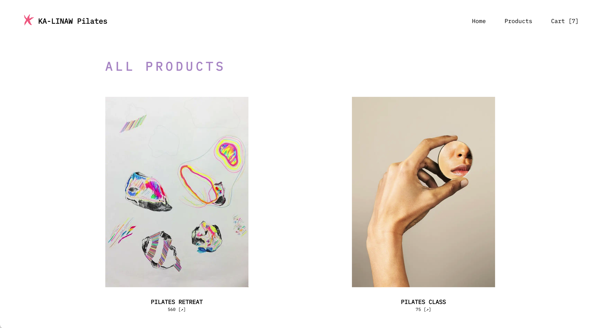
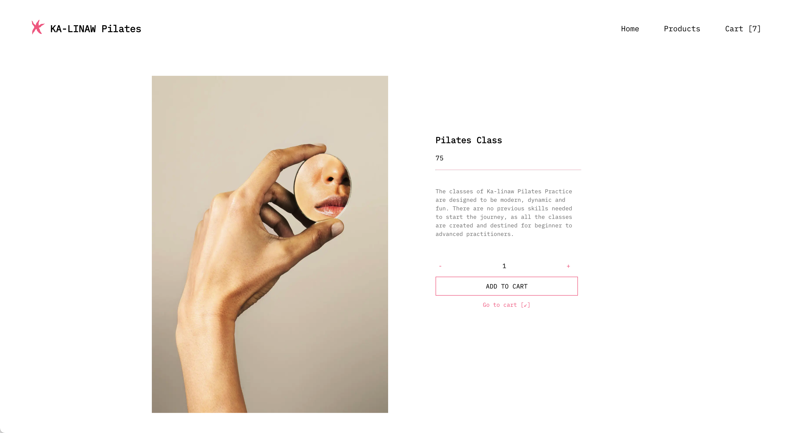

# E-commerce store: Ka-linaw

## Description

Welcome to the repository for building an e-commerce store as part of a web development bootcamp task. This project aims to showcase the skills and knowledge acquired during the bootcamp in developing a fully functional online store.

With the use of modern web technologies and frameworks, this e-commerce store features a sleek and user-friendly interface, and a comprehensive back-end system to manage products and orders. This repository serves as a reference for future projects and to demonstrate the ability to design and implement a complete web application. Browse through the code and feel free to leave any feedback or suggestions.

Enjoy!

## Technologies used

- React - Next.js is built on top of React, a popular front-end JavaScript library. React allows for the creation of reusable components and the efficient updating of the user interface.

- Node.js - Next.js is a server-side rendering framework that runs on top of Node.js. Node.js provides a runtime environment for executing JavaScript code on the server.

- TypeScript - Next.js supports TypeScript, a typed superset of JavaScript that can improve code quality and reduce errors.

- SQL - a query language for APIs that allows for efficient data fetching and reduces the number of requests needed to render a page.

- Playwright - is an open-source Node.js library that allows you to automate user interactions with web browsers.

## Screenshots

### Ka-linaw Home

### Ka-linaw Products Overview

### Ka-linaw Product View

## Setup instructions

# Deployment instructions
